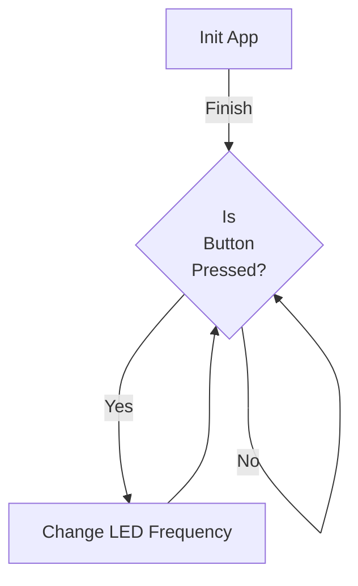

# Introduction

This document will walk you through the implementation of the "iXplement" application features. This feature introduces a new task in the application that toggles an LED at a certain frequency. The frequency can be changed by pressing a button.

We will cover:

1. How the task is created and started.

2. How the task function is implemented.

3. How the button press is handled to change the LED toggle frequency.

# Task creation and start

<SwmSnippet path="/App/Src/app.c" line="1">

---

The first part of the implementation is the creation and start of the task. This is done in the <SwmToken path="/App/Src/app.c" pos="9:2:2" line-data="void app_init(void)">`app_init`</SwmToken> function in the <SwmPath>[App/Src/app.c](/App/Src/app.c)</SwmPath> file. The task is defined with a normal priority and a stack size of 4096 bytes. After the task is defined, it is created and started. The handle to the task is stored in the <SwmToken path="/App/Src/app.c" pos="5:2:2" line-data="osThreadId defaultTaskHandle;">`defaultTaskHandle`</SwmToken> variable for future reference.

```c
#include "app.h"
#include "peripherals.h"
#include "cmsis_os.h"

osThreadId defaultTaskHandle;

void StartDefaultTask(void const * argument);

void app_init(void)
{
  /* Create the thread(s) */
  /* definition and creation of defaultTask */
  osThreadDef(defaultTask, StartDefaultTask, osPriorityNormal, 0, 4096);
  defaultTaskHandle = osThreadCreate(osThread(defaultTask), NULL);
}


  /* USER CODE BEGIN Header_StartDefaultTask */
/**
  * @brief  Function implementing the defaultTask thread.
  * @param  argument: Not used
  * @retval None
  */
/* USER CODE END Header_StartDefaultTask */
void StartDefaultTask(void const * argument)
{
  static uint32_t task_delay = 50;
  /* Infinite loop */
  for(;;)
  {
	  HAL_GPIO_TogglePin(LD3_GPIO_Port, LD3_Pin);
    if(HAL_GPIO_ReadPin(B1_GPIO_Port, B1_Pin) != GPIO_PIN_RESET)
    {
      if (50 == task_delay)
      {
        task_delay = 250;
      }
      else
      {
        task_delay = 50;
      }
      /* Some Debouncing */
      osDelay(100);
    }
    osDelay(task_delay);
  }
  /* USER CODE END 5 */
}
```

---

</SwmSnippet>

# Task function implementation

<SwmSnippet path="/App/Src/app.c" line="1">

---

The task function <SwmToken path="/App/Src/app.c" pos="7:2:2" line-data="void StartDefaultTask(void const * argument);">`StartDefaultTask`</SwmToken> is implemented in the same <SwmPath>[App/Src/app.c](/App/Src/app.c)</SwmPath> file. This function is an infinite loop that toggles an LED every <SwmToken path="/App/Src/app.c" pos="29:5:5" line-data="  static uint32_t task_delay = 50;">`task_delay`</SwmToken> milliseconds. The <SwmToken path="/App/Src/app.c" pos="29:5:5" line-data="  static uint32_t task_delay = 50;">`task_delay`</SwmToken> variable is initially set to 50 milliseconds, meaning that the LED will toggle every 50 milliseconds.

```c
#include "app.h"
#include "peripherals.h"
#include "cmsis_os.h"

osThreadId defaultTaskHandle;

void StartDefaultTask(void const * argument);

void app_init(void)
{
  /* Create the thread(s) */
  /* definition and creation of defaultTask */
  osThreadDef(defaultTask, StartDefaultTask, osPriorityNormal, 0, 4096);
  defaultTaskHandle = osThreadCreate(osThread(defaultTask), NULL);
}


  /* USER CODE BEGIN Header_StartDefaultTask */
/**
  * @brief  Function implementing the defaultTask thread.
  * @param  argument: Not used
  * @retval None
  */
/* USER CODE END Header_StartDefaultTask */
void StartDefaultTask(void const * argument)
{
  static uint32_t task_delay = 50;
  /* Infinite loop */
  for(;;)
  {
	  HAL_GPIO_TogglePin(LD3_GPIO_Port, LD3_Pin);
    if(HAL_GPIO_ReadPin(B1_GPIO_Port, B1_Pin) != GPIO_PIN_RESET)
    {
      if (50 == task_delay)
      {
        task_delay = 250;
      }
      else
      {
        task_delay = 50;
      }
      /* Some Debouncing */
      osDelay(100);
    }
    osDelay(task_delay);
  }
  /* USER CODE END 5 */
}
```

---

</SwmSnippet>

# Button press handling



<SwmSnippet path="/App/Src/app.c" line="1">

---

The button press is handled in the same <SwmToken path="/App/Src/app.c" pos="7:2:2" line-data="void StartDefaultTask(void const * argument);">`StartDefaultTask`</SwmToken> function. If the button is pressed, the <SwmToken path="/App/Src/app.c" pos="29:5:5" line-data="  static uint32_t task_delay = 50;">`task_delay`</SwmToken> variable is changed. If it was 50, it is changed to 250, and if it was 250, it is changed back to 50. This means that pressing the button will change the LED toggle frequency between every 50 milliseconds and every 250 milliseconds. After the button press is handled, there is a delay of 100 milliseconds for debouncing.

```c
#include "app.h"
#include "peripherals.h"
#include "cmsis_os.h"

osThreadId defaultTaskHandle;

void StartDefaultTask(void const * argument);

void app_init(void)
{
  /* Create the thread(s) */
  /* definition and creation of defaultTask */
  osThreadDef(defaultTask, StartDefaultTask, osPriorityNormal, 0, 4096);
  defaultTaskHandle = osThreadCreate(osThread(defaultTask), NULL);
}


  /* USER CODE BEGIN Header_StartDefaultTask */
/**
  * @brief  Function implementing the defaultTask thread.
  * @param  argument: Not used
  * @retval None
  */
/* USER CODE END Header_StartDefaultTask */
void StartDefaultTask(void const * argument)
{
  static uint32_t task_delay = 50;
  /* Infinite loop */
  for(;;)
  {
	  HAL_GPIO_TogglePin(LD3_GPIO_Port, LD3_Pin);
    if(HAL_GPIO_ReadPin(B1_GPIO_Port, B1_Pin) != GPIO_PIN_RESET)
    {
      if (50 == task_delay)
      {
        task_delay = 250;
      }
      else
      {
        task_delay = 50;
      }
      /* Some Debouncing */
      osDelay(100);
    }
    osDelay(task_delay);
  }
  /* USER CODE END 5 */
}
```

---

</SwmSnippet>

This implementation allows for a simple and efficient way to change the LED toggle frequency by pressing a button. The task is created and started at the application initialization, and it runs continuously, checking for button presses and toggling the LED at the specified frequency.

&nbsp;

<SwmMeta version="3.0.0" repo-id="Z2l0aHViJTNBJTNBaVhwbGVtZW50JTNBJTNBZWYxMg==" repo-name="iXplement"><sup>Powered by [Swimm](https://app.swimm.io/)</sup></SwmMeta>
